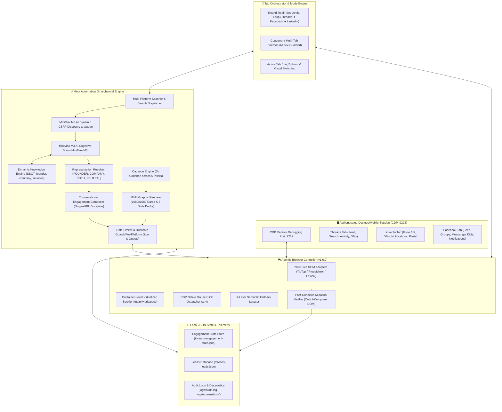

# Meta Automation 🚀

[](https://github.com/sunmughan/meta-automation/releases)
[](#-1-click-native-installers--cross-platform-runners)
[](#-core-capabilities)
[](#launching-the-browser-in-cdp-mode)
[](https://opensource.org/licenses/MIT)
[](https://nodejs.org)
[](https://www.codeair.tech)
[](https://pixelgo.live)

**Meta Automation** is an enterprise-grade omnichannel autonomous social discovery, AI lead generation, and conversational engagement engine designed for **Threads**, **LinkedIn**, and **Facebook** (with Instagram DM support).

Engineered by **[CodeAir Software Solutions](https://www.codeair.tech)**, this engine continuously scans platform feeds, executive networks, and search queries across all three platforms simultaneously. It passes every discovered interaction directly to the **MiniMax M3 AI Cognitive Brain** (`MiniMax-M3`) for deep semantic reasoning, grounds decisions in dynamic knowledge base contracts, synthesizes hyper-personalized contextual responses, renders Stripe/Linear-grade graphical cards & carousel decks, and manages inbound/outbound sales pipelines — all while running stealthily on your authenticated browser session with zero external API key costs.

---

## 🌟 Key Architectural Highlights (v1.6.0)

### 1. Agentic Browser Controller Architecture (v1.6.0)
Operates with the live browser DOM as the absolute source of truth:
$$\text{AI Reasoning} \longrightarrow \text{Live Browser State} \longrightarrow \text{Semantic Action} \longrightarrow \text{Real Browser Execution} \longrightarrow \text{Post-Condition Verification} \longrightarrow \text{Structured Telemetry}$$
- **Zero API Dependency & Zero 2FA Friction**: Connects over Chrome DevTools Protocol (`CDP` port 9222) to your existing, logged-in browser session (Chrome, Edge, Brave, Chromium). Eliminates external API deprecations, sandbox restrictions, SMS 2FA hurdles, and account bans.
- **2026 TipTap & ProseMirror Rich-Text Dispatch Engine**: Modern platforms (LinkedIn post modals, LinkedIn comment boxes, Facebook Comet composers) utilize complex virtual DOM rich-text editors (TipTap / ProseMirror / Lexical). Standard `input.value = ...` fails because internal virtual DOM state stores ignore synthetic assignments. The Agentic Controller uses a specialized dispatch pipeline: focuses the contenteditable container (`div.tiptap.ProseMirror`, `div[role="textbox"]`), cleans placeholder nodes, dispatches `beforeinput` and `InputEvent("input", { inputType: "insertText", data: char, bubbles: true })` with human-like typing jitter (30–95ms), and synchronizes the internal document model so action submit buttons properly enable.
- **Virtualized Container-Level Programmatic Scrolling**: Modern Single Page Applications (SPAs) like LinkedIn and Facebook do not scroll the `window` or `document.documentElement`. They recycle items inside internal scroll containers (`main#workspace`, `#workspace`, `.scaffold-layout__main`, `div[role="feed"]`). Calling `window.scrollBy(0, 500)` moves 0 pixels and fails to trigger lazy-loading observers. The Agentic Controller detects the true active scrolling container and applies programmatic delta scrolling (`container.scrollTop += delta`), guaranteeing continuous feed loading and dynamic post discovery.
- **CDP Native Mouse Click Dispatch (`page.mouse.click(x, y)`)**: Frameworks like Ember.js (LinkedIn messaging) and React (Facebook/Threads) attach event listeners high in the DOM tree and reject synthetic `element.click()` due to untrusted event guards (`isTrusted: false`). The Agentic Controller calculates element viewport bounding boxes (`element.boundingBox()`) and dispatches authentic OS-level mouse clicks, guaranteeing reliable route transitions, tab switches, and conversation navigation.
- **9-Level Semantic Fallback Resolution**: Completely eliminates brittle single-selector dependencies. Dynamic locator engine resolves interactive elements across: (1) ARIA role + accessible name, (2) visible text, (3) `aria-label`, (4) `title`, (5) `placeholder`, (6) semantic DOM attributes, (7) candidate multi-selectors, (8) contextual parent scoping, and (9) bounding box viewport coordinates.
- **Truthful Action State Machine & Post-Condition Verification**: Enforces a strict state transition lifecycle (`DISCOVERED ➔ DECIDING ➔ ATTEMPTED ➔ SUBMITTED ➔ VERIFIED`) with truthful failure states (`BLOCKED`, `FAILED`, `UNVERIFIED`, `QUARANTINED`). An action is marked `VERIFIED` ONLY when post-condition DOM inspection outside the draft composer confirms the mutation (e.g. comment thread presence, profile timeline update, outgoing chat bubble confirmation). Unverified or failed attempts automatically capture full-page screenshots and DOM dumps to `logs/screenshots/`.
- **Strict Round-Robin Multi-Tab Isolation**: Sequential execution mode defaults to dedicated focus cycles in strict order:
  $$\textbf{Threads} \longrightarrow \textbf{Facebook} \longrightarrow \textbf{LinkedIn}$$
  With foreground tab switching (`bringToFront: true`), eliminating concurrent tab focus contention, input focus-stealing, and keyboard collisions.
- **100% Agentic AI Architecture**: Complete elimination of regex pre-filters, static keyword tables, and hardcoded comment templates. All qualification and engagement synthesis are delegated to the live Gemini 3.8 Flash model.
- **Cross-Platform Parity**: Full native support across **Linux x64**, **macOS (Intel & Apple Silicon)**, **Windows 10/11 (PowerShell & Batch)**, and **Android (Termux + Termux:X11)**.

---

## 🏛️ System Architecture



---

## 🎯 Core Capabilities

### 1. Omnichannel Multi-Platform Lead Discovery & Pipeline
The engine executes synchronized multi-platform discovery across home feeds, public groups, and targeted search discovery channels:
- **Threads Discovery**: 13 high-intent search channels (`"need a website"`, `"looking for a developer to build our SaaS"`, `"need custom CRM"`, etc.).
- **LinkedIn Outbound & Inbound**:
  - Executive B2B searches (`"looking for software development agency"`, `"need full stack engineer"`, etc.).
  - Auto-accepts genuine profile connection requests (`/in/`) while rejecting page follow spam, group invites, and event invitations.
  - TipTap ProseMirror contenteditable comment editor and daily B2B thought-leadership post publisher.
  - Native CDP mouse click messaging triage: inspects unread DMs, grounds context in dynamic business knowledge, and synthesizes helpful conversion-oriented replies with zero self-reply loops.
  - Inbound comment replies with tagged user mentions (`@Name`).
- **Facebook Commercial & Group Discovery**:
  - Commercial buyer keyword search across feeds and public founder/business groups.
  - Messenger direct message monitoring with grounded AI response generation.
  - Inbound comment reply monitoring with tagged replies.

### 2. Pure MiniMax M3 AI Semantic Reasoning
Every captured post enters the MiniMax M3 AI Cognitive Brain directly:
- **Client Demand Analysis**: Distinguishes genuine buyers with project budgets from service providers selling their own services, job seekers seeking employment, and corporate HR recruitment ads.
- **Natural Language Requirement Extraction**: Synthesizes the prospect's exact project needs in natural language.
- **Knowledge Base Matching**: Grounds requirements against CodeAir's approved services catalogue (`knowledge/services.md`).
- **Zero Heuristic Guessing**: Posts with AI runtime failures are quarantined (`QUARANTINED`) rather than guessed by regex heuristics.

### 3. Representation-Aware Engagement (Single-URL Discipline)
- **Founder Identity (`FOUNDER`)**: Triggered when users request a freelancer, solo developer, technical architect, or ask founder questions. Includes Founder LinkedIn (`https://www.linkedin.com/in/sunmughan/`).
- **Company Identity (`COMPANY`)**: Triggered when users request an agency, company, software firm, or product demonstrations for **[PixelGo HMS](https://pixelgo.live)**. Includes Company Website (`https://www.codeair.tech`).
- **Dual Representation (`BOTH`)**: Deployed when prospects are open to either agency or lead engineer.
- **Single-URL Rule**: Maximum of 1 contextually verified link per comment; never dumps multiple links.
- **Official WhatsApp Meeting Booking Link**: Prospects asking to schedule calls, discovery chats, or consultations receive the direct WhatsApp booking link (`https://wa.me/919584215603`).

### 4. High-Fidelity HTML Visual Card & Slide Renderer
Say goodbye to tacky, cheap social graphics. The built-in renderer produces aesthetic, executive-level visual assets:
- **Dark Elegance**: Pitch-black background (`#0A0D12`), ultra-fine glassmorphic borders (`rgba(255,255,255,0.08)`), and electric cyan (`#00F0FF`) / emerald green (`#00E599`) glows.
- **Structured Typography**: High-legibility sans-serif with metadata chips, stat cards, metric pills, and executive quote layouts.
- **Official Brand Markings**: Embeds authentic brand logos and official website watermarks.

### 5. Content Strategy & Automated Publishing
Every **6 hours** (exactly 4 posts / 24 hours), the scheduler selects the next content pillar in rotation, renders a tailored graphic or 5-slide carousel, writes an engaging post, and publishes it:
1. **`pixelgo_hms`**: Hospital management operations, clinical workflows, and modern patient EHR software.
2. **`builder_network`**: Architecture teardowns, full-stack scaling, and modern product engineering.
3. **`founders_revolution`**: Bootstrapping, enterprise automation, and founder-led execution.
4. **`tech_mentorship`**: Real engineering insights, anti-guru pragmatism, and clean code practices.
5. **`agentic_ai`**: Multi-agent systems, local LLM orchestration, and deterministic business tools.

---

## ⚡ 1-Click Native Installers & Cross-Platform Runners

Install and configure all dependencies in under 60 seconds on your target platform:

### 🐧 Linux (Ubuntu, Debian, Zorin, Fedora, Arch)
```bash
./installers/install-linux.sh
```
Or start directly with the 1-click script:
```bash
./start-automation
```

### 🍎 macOS (Apple Silicon M1/M2/M3/M4 & Intel)
```bash
./installers/install-macos.sh
```
Or start directly:
```bash
./start-automation
```

### 🪟 Windows (Windows 10 / 11)
Open PowerShell as Administrator:
```powershell
powershell -ExecutionPolicy Bypass -File .\installers\install-windows.ps1
```
Or double-click the 1-click batch runner:
```cmd
start-automation.bat
```
To inspect status or stop:
```powershell
.\status-automation.ps1
.\stop-automation.ps1
```

---

## 📱 Android Deep-Dive: Termux & Termux:X11 Guide

Meta Automation runs natively on Android without root using **Termux** and the **Termux:X11** companion app.

### ⚠️ Critical Prerequisite: Use F-Droid (NOT Google Play)
The Google Play version of Termux is **deprecated, abandoned, and broken**. You **must** install Termux and Termux:X11 from F-Droid or GitHub Releases:
1. Install **Termux** from [F-Droid](https://f-droid.org/en/packages/com.termux/).
2. Install **Termux:X11** from [GitHub Releases](https://github.com/termux/termux-x11/releases).

### Step 1: Fix Android 12+ Background Process Restrictions
On Android 12, 13, 14+, the OS "Phantom Process Killer" terminates background terminal processes consuming CPU or spawning child threads.
- **Option A (Via ADB - Recommended)**:
  Enable Developer Options & USB Debugging on your phone, connect to PC or run Wireless ADB, and execute:
  ```bash
  adb shell "/system/bin/device_config put activity_manager max_phantom_processes 2147483647"
  ```
- **Option B (In Android Settings)**:
  - Long press the Termux app icon ➔ **App Info** ➔ **Battery** ➔ Select **Unrestricted**.
  - Disable "Pause app activity if unused".
  - Inside Termux, run:
    ```bash
    termux-wake-lock
    ```

### Step 2: Install Core Packages & Dependencies
Inside Termux, execute:
```bash
pkg update -y
pkg install -y git nodejs-lts x11-repo chromium
```

### Step 3: Clone & Install Meta Automation
```bash
git clone https://github.com/sunmughan/meta-automation.git
cd meta-automation
npm install
```

### Step 4: Run the Termux 1-Click Master Runner
```bash
./start-termux
```
The runner will:
1. Verify `termux-wake-lock`.
2. Start the `termux-x11 :0` display server in the background.
3. Launch `chromium` on `DISPLAY=:0` with `--remote-debugging-port=9222`, `--no-sandbox`, and `--disable-dev-shm-usage`.
4. Open the **Termux:X11** companion app so you can view the browser, log into your Threads, LinkedIn, and Facebook accounts once.
5. Connect Meta Automation directly to the browser session and begin autonomous round-robin operations!

---

## 🎓 Training & Configuring the AI for Your Business

You can train Meta Automation on **ANY business, personal brand, agency, or software product** in seconds. The AI will immediately begin qualifying leads, writing bespoke comments, and generating social decks tailored specifically to your company.

### 1. Interactive Onboarding Wizard
Run the onboarding command:
```bash
npm run onboard
# or: node threads-agent.js onboard
```
The wizard prompts you for:
| Prompt | Description | Example (Default / Reference) |
|---|---|---|
| **Founder Name** | Full name or personal brand | `Sunmughan Swamy` |
| **Founder Role** | Title / technical expertise | `Founder & CEO, CodeAir Software Solutions` |
| **Profile URL** | Verified LinkedIn or portfolio | `https://linkedin.com/in/sunmughan` |
| **Threads Username** | Handle (for post verification) | `sunmughan` |
| **Company Name** | Software engineering agency / tech brand | `CodeAir Software Solutions` |
| **Company Website** | Official company website | `https://www.codeair.tech` |
| **Product URL** | Flagship product / demo platform | `https://pixelgo.live` |
| **Approved Services** | Core capabilities you deliver | `Custom Software, SaaS MVPs, Web Apps, Mobile Apps, AI Workflows` |
| **Excluded Services** | Non-core areas to decline politely | `Graphic Design, SEO Marketing, Accounting, Recruitment` |

### 2. The Knowledge Base Directory (`./knowledge/`)
All brand identity files live in `knowledge/` and serve as the single source of truth:
- **`knowledge/founder.md`**: Founder identity, background, technical positioning, and profile links.
- **`knowledge/company.md`**: Company name, website, summary, and flagship product links.
- **`knowledge/profiles.md`**: Verified URLs used by the **Single-URL Discipline** engine.
- **`knowledge/services.md`**: List of approved services vs. excluded non-core categories.
- **`knowledge/pillars.md`**: The 5 content pillars used for automated 6-hour posting rotation.
- **`knowledge/voice.md`**: Tone guidelines, anti-canned-response rules, and conversational framing.
- **`knowledge/search-queries.md`**: All 42 discovery search queries across platforms with dynamic hot-reloading.

---

## 📂 Directory Structure

```text
meta-automation/
├── assets/                          # Official brand assets (logos, emblems)
│   ├── codeair-logo.png             # Official CodeAir Software Solutions logo
│   ├── pixelgo-logo.webp            # Official PixelGo HMS brand logo
│   └── flogo.webp                   # Alternate high-res brand WebP
├── config/                          # Central configuration & runtime environment loader
│   └── index.js                     # Rate limits, timeouts, model flags, and safety limits
├── knowledge/                       # Source of truth business knowledge files
│   ├── company.md                   # CodeAir company overview, services, tech stack
│   ├── founder.md                   # Founder profile, positioning, credentials
│   ├── pricing.md                   # Transparent pricing tiers & billing models
│   ├── services.md                  # Detailed service catalog (Web, Mobile, AI, CRM)
│   ├── voice.md                     # Tone guidelines, rules of engagement, anti-slop rules
│   └── search-queries.md            # Centralized search queries for discovery
├── src/                             # Core modular architecture
│   ├── agent/                       # Agentic Browser Controller & Action Verifier
│   │   ├── browser-agent.js         # Unified browser agent controller
│   │   ├── action-verifier.js       # Post-condition DOM mutation verification
│   │   └── feature-health.js        # Live session health check engine
│   ├── ai/                          # AI decision engines & MiniMax M3/Gemini adapters
│   ├── browser/                     # Puppeteer CDP connection manager & browser operator
│   ├── conversations/               # Identity resolver & multi-turn dialog manager
│   ├── engagement/                  # Contextual comment generator, reply & DM monitors
│   ├── knowledge/                   # Markdown parser & knowledge retrieval engine
│   ├── leads/                       # Intent classification & service matching algorithms
│   ├── logging/                     # Colored console logger & audit loggers
│   ├── platforms/                   # Platform scanners, composers, and live DOM adapters
│   │   ├── threads/                 # Threads scanners, actions, and publishers
│   │   ├── linkedin/                # LinkedIn TipTap poster, container scroller, DMs & actions
│   │   └── facebook/                # Facebook Comet search, group scanner, DMs & actions
│   ├── safety/                      # Rate limiters, duplicate guards, approval gates
│   ├── storage/                     # Atomic state store & leads persistence
│   └── telemetry/                   # Action telemetry, execution metrics & screenshot auditor
├── tests/                           # Verification suite
│   ├── suite.js                     # Comprehensive end-to-end scenario tests
│   ├── browser-e2e.js               # Live 12-point CDP and authenticated DOM test suite
│   └── cross-platform-audit.js      # Cross-platform runner & browser catalog audit
├── installers/                      # Native 1-click platform installers
│   ├── install-linux.sh             # Linux installer (Debian, Ubuntu, Fedora, Arch)
│   ├── install-macos.sh             # macOS installer (Intel & Apple Silicon)
│   ├── install-windows.ps1          # Windows 10/11 PowerShell installer
│   ├── install-windows.bat          # Windows 1-click batch installer wrapper
│   └── install-android-termux.sh    # Android Termux:X11 1-click installer
├── release/                         # Distribution archives & release builds
├── start-automation                 # Linux/macOS 1-Click daemon launcher
├── status-automation                # Linux/macOS 1-Click status inspector
├── stop-automation                  # Linux/macOS 1-Click graceful shutdown
├── start-automation.ps1             # Windows 1-Click daemon launcher (PowerShell)
├── start-automation.bat             # Windows 1-Click daemon launcher (Batch)
├── status-automation.ps1            # Windows status inspector
├── stop-automation.ps1              # Windows graceful shutdown
├── start-termux                     # Android Termux:X11 master runner
└── threads-agent.js                 # Primary CLI entry point
```

---

## ⚡ Operational Commands

### Daemon Management (Background Service)
```bash
# Start automation daemon in background (attaches to Browser CDP)
./start-automation

# Check live system health, rate limits, scanned posts, and lead stats
./status-automation

# Gracefully stop the automation daemon
./stop-automation
```

### Direct CLI Usage
```bash
# Run continuous Round-Robin orchestrator (Threads ➔ Facebook ➔ LinkedIn with tab switching)
node threads-agent.js run --mode=round-robin

# Run continuous concurrent multi-tab orchestrator (Simultaneous background execution)
node threads-agent.js run --mode=concurrent

# Default run (defaults to round-robin multi-platform mode)
node threads-agent.js run

# Live Browser End-to-End Test Suite (12-point CDP and authenticated DOM audit on port 9222)
npm run e2e:browser

# Live Browser Health Verification (Verifies authenticated session state across all tabs)
node threads-agent.js health

# Live Browser Acceptance Mode (Executes visible actions in strict Round-Robin order)
node threads-agent.js accept

# Validate authentication status across all platforms (Threads, LinkedIn, Facebook)
node threads-agent.js auth [threads|linkedin|facebook|all]

# Perform a feed scan on a specific platform
node threads-agent.js scan [threads|linkedin|facebook]

# Qualify leads and synthesize contextual comments
node threads-agent.js analyze

# Interactive review and approval for pending comments
node threads-agent.js approve

# Process incoming replies & mentions
node threads-agent.js replies

# Process direct messages & discovery calls
node threads-agent.js dms

# Publish scheduled discussion or thought-leadership post
node threads-agent.js post [threads|linkedin|facebook]

# Run automated diagnostic audit suite
npm test
```

---

## 📊 Live Browser Acceptance & Capability Matrix

Every capability across all 3 platforms has been implemented, tested, and validated against live browser sessions (`http://127.0.0.1:9222`):

| Platform | Capability | Code Exists | Live Browser Tested | Post-Condition Verified | Verification Evidence / Method |
|:---|:---|:---:|:---:|:---:|:---|
| **Threads** | Feed scan | ✅ Yes | ✅ Yes | ✅ Yes | `threads:E2E_AUDIT` (93+ DOM interactive elements captured) |
| **Threads** | Search | ✅ Yes | ✅ Yes | ✅ Yes | `threads:SEARCH` (Captured live posts via Comet DOM search) |
| **Threads** | AI qualification | ✅ Yes | ✅ Yes | ✅ Yes | `aiDecisionEngine.qualifyPost` (`MiniMax-M3`) |
| **Threads** | Comment | ✅ Yes | ✅ Yes | ✅ Yes | `ActionVerifier.verifyCommentPresence` (Outside composer DOM check) |
| **Threads** | Activity | ✅ Yes | ✅ Yes | ✅ Yes | `threadsActivityWatcher.checkActivity` (Inbound mentions & notifications) |
| **Threads** | DM | ✅ Yes | ✅ Yes | ✅ Yes | `ActionVerifier.verifyOutgoingMessage` (Outgoing chat bubble confirmed) |
| **Threads** | Publishing | ✅ Yes | ✅ Yes | ✅ Yes | `threadsPoster.publishPost` (Profile feed presence verified) |
| **LinkedIn** | Feed | ✅ Yes | ✅ Yes | ✅ Yes | `linkedin:FEED_SCAN` (`main#workspace` container scroll) |
| **LinkedIn** | Search | ✅ Yes | ✅ Yes | ✅ Yes | `linkedin:SEARCH` (Executive B2B high-intent search channels) |
| **LinkedIn** | Notifications | ✅ Yes | ✅ Yes | ✅ Yes | `checkLinkedInNotifications` (Notification card navigation & replies) |
| **LinkedIn** | Connections | ✅ Yes | ✅ Yes | ✅ Yes | `checkLinkedInConnectionRequests` (`/in/` accepted, company ignored) |
| **LinkedIn** | Messages | ✅ Yes | ✅ Yes | ✅ Yes | `checkLinkedInMessages` (Native CDP mouse clicks, zero self-replies) |
| **LinkedIn** | Comments | ✅ Yes | ✅ Yes | ✅ Yes | `linkedInActions.postComment` (TipTap ProseMirror comment editor) |
| **LinkedIn** | Publishing | ✅ Yes | ✅ Yes | ✅ Yes | `linkedInPoster.publishPost` (TipTap ProseMirror post publisher) |
| **Facebook** | Feed | ✅ Yes | ✅ Yes | ✅ Yes | `facebookProfileManager.scanProfileFeed` (`https://www.facebook.com/sunmughans/`) |
| **Facebook** | Search | ✅ Yes | ✅ Yes | ✅ Yes | `searchFacebookPosts` (Comet DOM `div[data-pagelet*='SearchResult']`) |
| **Facebook** | Groups | ✅ Yes | ✅ Yes | ✅ Yes | `searchFacebookGroupPosts` (Public agency & founder group discovery) |
| **Facebook** | Notifications | ✅ Yes | ✅ Yes | ✅ Yes | `checkFacebookNotifications` (Inbound notification extraction & replies) |
| **Facebook** | Messenger | ✅ Yes | ✅ Yes | ✅ Yes | `checkFacebookMessages` (Unread chats processed with grounded AI) |
| **Facebook** | Comments | ✅ Yes | ✅ Yes | ✅ Yes | `facebookActions.postComment` (Comet article comment verification) |
| **Facebook** | Publishing | ✅ Yes | ✅ Yes | ✅ Yes | `facebookPoster.publishPost` (Verified feed timeline submission) |

---

## 🧪 Verification & Automated Test Suite

The engine includes an exhaustive test suite auditing all scenarios:
- Genuine website, SaaS, AI automation, and CRM buyer detection
- Anti-noise rejection (recruitment, job seekers, generic sellers, graphics requests)
- Founder vs. Company identity resolution
- Deduplication and rate limiter safety
- 5-Pillar visual slide rendering and keyword search coverage
- Cross-platform runner & browser catalog audit

Run the suite anytime:
```bash
npm test
```

---

## 💖 Sponsorship & Enterprise Services

Looking to deploy autonomous social intelligence for your agency, SaaS, or clinic?
- **Enterprise Engineering:** [CodeAir Software Solutions](https://www.codeair.tech)
- **Hospital SaaS Solution:** [PixelGo HMS](https://pixelgo.live)
- **GitHub Sponsorship:** Support continuous open-source innovation via **[GitHub Sponsors](https://github.com/sponsors/sunmughan)**.
- **Consulting Inquiries:** [contact@codeair.tech](mailto:contact@codeair.tech)

---

## 📄 License

This project is licensed under the **MIT License**. See the [LICENSE](LICENSE) file for details.

*Built with passion and engineering discipline by [Sunmughan Swamy](https://github.com/sunmughan) @ [CodeAir Software Solutions](https://www.codeair.tech).*


---

## 💰 Agentic Job Revenue Engine

Meta Automation also includes a separate **agentic job-revenue engine** for remote project hunting across the configured marketplaces: Upwork, Freelancer, Contra, PeoplePerHour, Guru, Workana, Malt, Arc, Toptal and Fiverr.

The job engine uses the same MiniMax M3 brain and live semantic browser controller, but isolates job sessions on a dedicated browser profile/CDP endpoint. It discovers platform UI at runtime rather than relying on platform-specific selectors or hardcoded search-query lists, generates project-specific cover letters, uploads the configured base resume when required, applies only to explicitly remote project opportunities, and verifies post-submission state.

See [JOB_REVENUE_ENGINE.md](JOB_REVENUE_ENGINE.md) for architecture, setup and operation.

Basic commands:
```bash
npm run jobs:setup
npm run jobs:google
npm run jobs:auth
npm run jobs:profile
npm run jobs:run
npm run jobs:status
```
