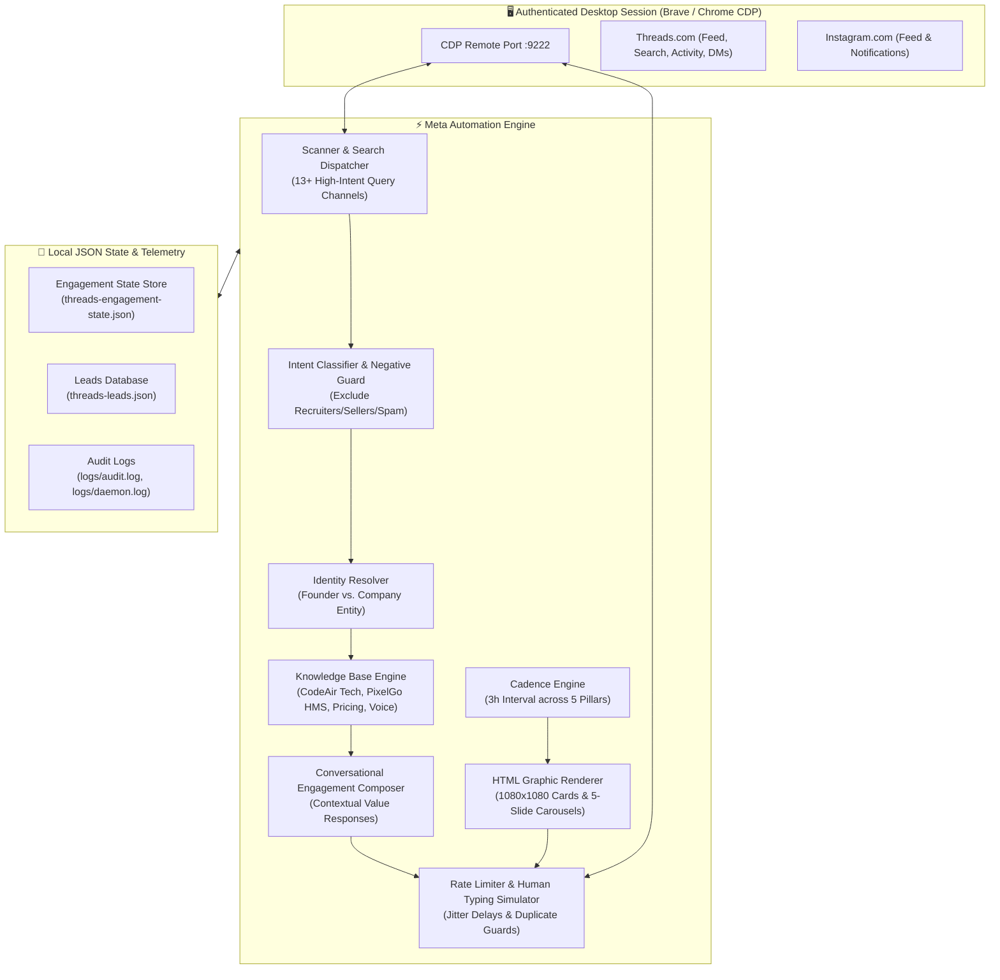

# Meta Automation 🚀

[](https://github.com/sunmughan/meta-automation/releases)
[](https://opensource.org/licenses/MIT)
[](https://nodejs.org)
[](https://brave.com)
[](https://www.codeair.tech)
[](https://pixelgo.live)

**Meta Automation** is an enterprise-grade autonomous social discovery, AI lead generation, and conversational engagement engine designed for **Threads** and **Instagram**.

Engineered by **[CodeAir Software Solutions](https://www.codeair.tech)**, this engine continuously scans platform feeds and search queries, extracts prospective client inquiries, filters out noise (recruiters, job seekers, generic sellers), generates hyper-personalized contextual responses, renders Stripe/Linear-grade graphical cards & carousel decks, and manages multi-turn sales conversations — all while running stealthily on your authenticated browser session.

---

## 📑 Table of Contents

- [Key Architectural Highlights](#key-architectural-highlights)
- [System Architecture](#system-architecture)
- [Core Capabilities](#core-capabilities)
  - [1. High-Intent Lead Discovery](#1-high-intent-lead-discovery)
  - [2. Multi-Tier Semantic Filtering](#2-multi-tier-semantic-filtering)
  - [3. Dual Identity Routing (Founder vs. Company)](#3-dual-identity-routing-founder-vs-company)
  - [4. High-Fidelity HTML Visual Card & Slide Renderer](#4-high-fidelity-html-visual-card--slide-renderer)
  - [5. Content Strategy & Automated Publishing](#5-content-strategy--automated-publishing)
  - [6. Anti-Bot Stealth & Operational Guardrails](#6-anti-bot-stealth--operational-guardrails)
- [Directory Structure](#directory-structure)
- [Getting Started](#getting-started)
  - [Prerequisites](#prerequisites)
  - [Installation](#installation)
  - [Environment Configuration](#environment-configuration)
  - [Launching the Browser in CDP Mode](#launching-the-browser-in-cdp-mode)
- [Operational Commands](#operational-commands)
  - [Daemon Management (Background Service)](#daemon-management-background-service)
  - [Direct CLI Usage](#direct-cli-usage)
- [Verification & Automated Test Suite](#verification--automated-test-suite)
- [Sponsorship & Enterprise Services](#sponsorship--enterprise-services)
- [License](#license)

---

## 🌟 Key Architectural Highlights

- **Zero Session Friction**: Connects directly to your already-logged-in desktop browser (Brave / Chromium) over Chrome DevTools Protocol (`CDP`). **Zero risk of credential theft, session invalidation, or SMS 2FA prompts.**
- **Autonomous Multi-Agent Brain**: Employs deep contextual LLM analysis (Gemini / Antigravity Agent Runtime) backed by structured business knowledge from `knowledge/`.
- **Stripe/Linear-Grade Graphic Rendering**: Renders 1080x1080 high-contrast social cards, metric grids, and multi-slide carousel decks directly with headless CSS/HTML rendering and official SVG/WebP branding.
- **Persistent Background Daemon**: Comes equipped with process management (`start-automation`, `status-automation`, `stop-automation`) that runs 24/7 in the background with auto-restart and telemetry tracking.

---

## 🏛️ System Architecture



---

## 🎯 Core Capabilities

### 1. High-Intent Lead Discovery
The engine scans both organic home feeds and 13 dedicated search discovery channels covering direct purchase inquiries:
- `"need a website"` / `"looking for a web designer"` / `"need someone to build a website"`
- `"looking for a developer to build our SaaS"` / `"need a full stack developer"`
- `"looking for AI development team"` / `"automate customer support using AI"`
- `"need a custom CRM"` / `"looking for hospital management system"`

### 2. Multi-Tier Semantic Filtering
Rejects 100% of unqualified noise through strict negative pattern matching:
- **Recruiters & HR Announcements**: Ignored (`"we are hiring"`, `"job vacancy"`).
- **Job Seekers**: Ignored (`"hire me"`, `"looking for job"`).
- **Generic Service Pitches**: Ignored (`"check my bio"`, `"DM for cheap logos"`).
- **Graphic Design/Unrelated Solicitations**: Ignored.

### 3. Dual Identity Routing (Founder vs. Company)
- **Founder Identity (`Sunmughan Swamy`)**: Triggered when users ask personal questions, discuss technical architecture/philosophy, or request founder connections. Writes in a direct, sharp, technical builder tone.
- **Company Identity (`CodeAir Software Solutions`)**: Triggered for commercial proposals, service quotations, pricing inquiries, and product demonstrations for **[PixelGo HMS](https://pixelgo.live)**.

### 4. High-Fidelity HTML Visual Card & Slide Renderer
Say goodbye to tacky, cheap social graphics. The built-in renderer produces aesthetic, executive-level visual assets:
- **Dark Elegance**: Pitch-black background (`#0A0D12`), ultra-fine glassmorphic borders (`rgba(255,255,255,0.08)`), and electric cyan (`#00F0FF`) / emerald green (`#00E599`) glows.
- **Structured Typography**: High-legibility sans-serif with metadata chips, stat cards, metric pills, and executive quote layouts.
- **Official Brand Markings**: Embeds the authentic CodeAir logo with `www.codeair.tech` and the PixelGo calligraphic emblem with `pixelgo.live`.

### 5. Content Strategy & Automated Publishing
Every **3 hours**, the scheduler selects the next content pillar in rotation, renders a tailored graphic or 5-slide carousel, writes an engaging post, and publishes it:
1. **`pixelgo_hms`**: Hospital management operations, clinical workflows, and modern patient EHR software.
2. **`builder_network`**: Architecture teardowns, full-stack scaling, and modern product engineering.
3. **`founders_revolution`**: Bootstrapping, enterprise automation, and founder-led execution.
4. **`tech_mentorship`**: Real engineering insights, anti-guru pragmatism, and clean code practices.
5. **`agentic_ai`**: Multi-agent systems, local LLM orchestration, and deterministic business tools.

### 6. Anti-Bot Stealth & Operational Guardrails
- **Human Typing Simulation**: Key strokes are typed with human-like variable cadence and random jitter.
- **Duplicate Prevention**: Multi-hash lookup prevents ever commenting on the same thread twice or sending duplicate direct messages.
- **Hourly Ceilings**: Strict enforcement of safe action quotas:
  - Max 25 New Post Comments / hour
  - Max 60 Total Replies / hour
  - Max 30 Direct Messages / hour
- **Dry-Run & Approval Modes**: Test all actions safely in simulation mode before enabling autonomous live execution.

---

## 📂 Directory Structure

```text
meta-automation/
├── assets/                          # Official brand assets (logos, emblems)
│   ├── codeair-logo.png             # Official CodeAir Software Solutions logo
│   ├── pixelgo-logo.webp            # Official PixelGo HMS brand logo
│   └── flogo.webp                   # Alternate high-res brand WebP
├── config/                          # Central configuration & runtime environment loader
│   └── index.js                     # Rate limits, timeouts, model flags, and safety limits
├── knowledge/                       # Source of truth business knowledge files
│   ├── company.md                   # CodeAir company overview, services, tech stack
│   ├── founder.md                   # Founder profile, positioning, credentials
│   ├── pricing.md                   # Transparent pricing tiers & billing models
│   ├── services.md                  # Detailed service catalog (Web, Mobile, AI, CRM)
│   └── voice.md                     # Tone guidelines, rules of engagement, anti-slop rules
├── scripts/                         # Operational helper scripts
│   ├── launch-brave-cdp.sh          # Launches Brave browser with remote debugging port 9222
│   ├── start-agent.sh               # Background daemon launcher with process tracking
│   ├── status-agent.sh              # Telemetry reporting script
│   └── stop-agent.sh                # Graceful process termination script
├── src/                             # Core modular architecture
│   ├── ai/                          # AI decision engines & Antigravity/Gemini adapters
│   ├── browser/                     # Puppeteer CDP connection manager & page pooling
│   ├── conversations/               # Identity resolver & multi-turn dialog manager
│   ├── engagement/                  # Contextual comment generator, reply & DM monitors
│   ├── knowledge/                   # Markdown parser & knowledge retrieval engine
│   ├── leads/                       # Intent classification & service matching algorithms
│   ├── logging/                     # Colored console logger & audit loggers
│   ├── platforms/                   # Threads & Instagram scanners, post composers & renderers
│   ├── safety/                      # Rate limiters, duplicate guards, approval gates
│   └── storage/                     # Atomic state store & leads persistence
├── tests/                           # Verification suite
│   └── suite.js                     # 33 comprehensive end-to-end scenario tests
├── .env.example                     # Environment template
├── .gitignore                       # Git ignore rules for state, secrets, and logs
├── LICENSE                          # MIT License
├── package.json                     # Project manifest & CLI entrypoints
├── README.md                        # Master documentation
├── SPONSORS.md                      # Sponsorship information
├── start-automation                 # 1-Click launcher (starts CDP + background agent)
├── status-automation                # 1-Click status inspector (shows health & stats)
├── stop-automation                  # 1-Click graceful shutdown
└── threads-agent.js                 # Primary CLI entry point
```

---

## 🚀 Getting Started

### Prerequisites
- **Node.js**: `v18.0.0` or higher.
- **Operating System**: Linux (Ubuntu, Debian, Zorin, Fedora), macOS, or Windows (WSL2).
- **Browser**: Brave Browser or Google Chrome installed.

### Installation
Clone the repository:
```bash
git clone https://github.com/sunmughan/meta-automation.git
cd meta-automation
npm install
```

### Environment Configuration
Copy the configuration template:
```bash
cp .env.example .env
```
Edit `.env` to suit your requirements:
```ini
# Chrome DevTools Protocol & Display
THREADS_CDP_URL=http://127.0.0.1:9222
DISPLAY=:0

# Operational Safety Modes
APPROVAL_MODE=false      # Set to 'true' to require human review before posting
DRY_RUN=false            # Set to 'true' to simulate actions without publishing
POSTING_ENABLED=true     # Master switch for live publishing

# AI Runtime
AI_RUNTIME=antigravity   # Primary runtime
AI_MODEL=gemini-3.6-flash
```

### Launching the Browser in CDP Mode
The engine communicates with your existing logged-in browser session via CDP.
Launch Brave with remote debugging enabled:
```bash
./scripts/launch-brave-cdp.sh
```
> **Tip:** You can log into Threads (`threads.net`) and Instagram (`instagram.com`) normally in this window. Your session, cookies, and tabs will remain completely intact.

---

## ⚡ Operational Commands

### Daemon Management (Background Service)
Manage the autonomous agent with 1-click control scripts:

```bash
# Start automation daemon in background (attaches to Brave CDP)
./start-automation

# Check live system health, rate limits, scanned posts, and lead stats
./status-automation

# Gracefully stop the automation daemon
./stop-automation
```

### Direct CLI Usage
You can also run specific tasks directly via `threads-agent.js`:

```bash
# Run continuous interactive automation loop in foreground
node threads-agent.js run

# Validate authentication status for Threads and Instagram
node threads-agent.js auth

# Perform a single scan of feed & search queries
node threads-agent.js scan

# Run AI qualification on newly discovered posts
node threads-agent.js analyze

# Interactive review CLI to approve pending drafted comments
node threads-agent.js approve

# Print telemetry and current state summary
node threads-agent.js status
```

---

## 🧪 Verification & Automated Test Suite

The engine includes an exhaustive test suite auditing 33 real-world scenarios:
- Genuine website, SaaS, AI automation, and CRM buyer detection
- Anti-noise rejection (recruitment, job seekers, generic sellers, graphics requests)
- Founder vs. Company identity resolution
- Deduplication and rate limiter safety
- 5-Pillar visual slide rendering and keyword search coverage

Run the suite anytime:
```bash
npm test
```

Expected output:
```text
==================================================
  CODEAIR AUTOMATION SUITE: 18 SCENARIO AUDIT
==================================================
  ✓ PASS: 1. Genuine website buyer
  ✓ PASS: 2. Genuine SaaS buyer
  ✓ PASS: 3. Genuine AI automation buyer
  ...
==================================================
  PILLAR, SEARCH & LEAD AUDIT (USER FEEDBACK FIXES)
==================================================
  ✓ PASS: High-intent search discovery configured with 13 buyer queries
  ✓ PASS: Configured 3-hour publishing interval (POST_INTERVAL_HOURS=3)
  ✓ PASS: Verified 5-slide deck & quote card for pillar: [pixelgo_hms]
  ...
--------------------------------------------------
Audit Summary: 33 Passed, 0 Failed
--------------------------------------------------
```

---

## 💖 Sponsorship & Enterprise Services

Looking to deploy autonomous social intelligence for your agency, SaaS, or clinic?
- **Enterprise Engineering:** [CodeAir Software Solutions](https://www.codeair.tech)
- **Hospital SaaS Solution:** [PixelGo HMS](https://pixelgo.live)
- **GitHub Sponsorship:** Support continuous open-source innovation via **[GitHub Sponsors](https://github.com/sponsors/sunmughan)**.
- **Consulting Inquiries:** [contact@codeair.tech](mailto:contact@codeair.tech)

---

## 📄 License

This project is licensed under the **MIT License**. See the [LICENSE](LICENSE) file for details.

*Built with passion and engineering discipline by [Sunmughan Swamy](https://github.com/sunmughan) @ [CodeAir Software Solutions](https://www.codeair.tech).*
