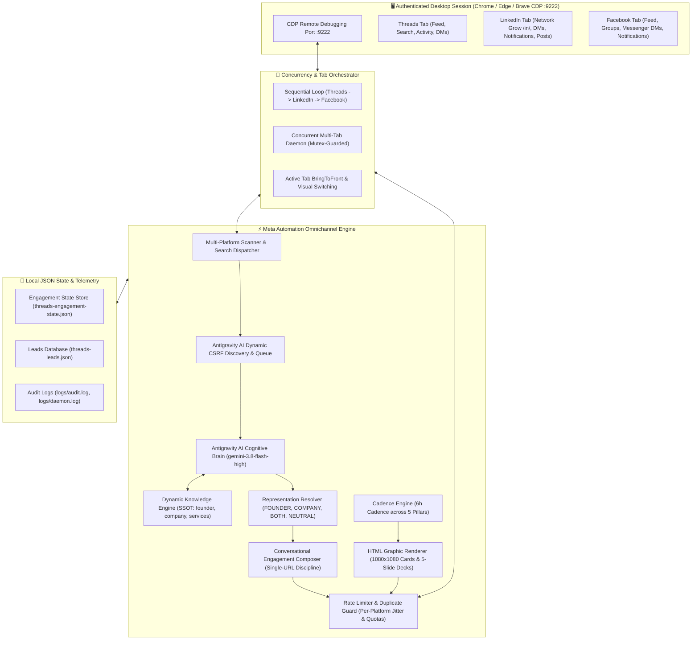

# Meta Automation 🚀

[](https://github.com/sunmughan/meta-automation/releases)
[](https://github.com/sunmughan/meta-automation#1-click-native-installers)
[](#1-omnichannel-multi-platform-lead-discovery--pipeline)
[](#launching-the-browser-in-cdp-mode)
[](https://opensource.org/licenses/MIT)
[](https://nodejs.org)
[-9945FF.svg?style=for-the-badge)](ANTIGRAVITY_GUIDE.md)
[](https://www.codeair.tech)
[](https://pixelgo.live)

**Meta Automation** is an enterprise-grade omnichannel autonomous social discovery, AI lead generation, and conversational engagement engine designed for **Threads**, **LinkedIn**, and **Facebook** (with Instagram DM support).

Engineered by **[CodeAir Software Solutions](https://www.codeair.tech)**, this engine continuously scans platform feeds, executive networks, and search queries across all three platforms simultaneously. It passes every discovered interaction directly to the **Antigravity AI Cognitive Brain** (`gemini-3.8-flash-high`) for deep semantic reasoning, grounds decisions in dynamic knowledge base contracts, synthesizes hyper-personalized contextual responses, renders Stripe/Linear-grade graphical cards & carousel decks, and manages inbound/outbound sales pipelines — all while running stealthily on your authenticated browser session with zero external API key costs.

---

## 🌟 Key Architectural Highlights

- **Omnichannel Autonomous Social Operations (v1.5.0)**: Unified concurrent and sequential multi-tab architecture operating across **LinkedIn**, **Facebook**, and **Threads** in your real authenticated desktop browser session with zero external API fees.
- **100% Zero-Heuristic AI Architecture**: Complete elimination of regex pre-filters, static keyword tables, and hardcoded comment templates. All qualification and engagement synthesis are delegated to the live Gemini 3.8 Flash model.
- **Externalized Dynamic Search Queries**: Search queries for all platforms are centralized in `knowledge/search-queries.md` with hot-reloading.
- **Pure Multi-Brand Neutrality**: Multi-brand state isolation, dynamic sender checking, and instant brand adaptation via `npm run onboard`.
- **LinkedIn Inbound & Outbound Pipeline**:
  - Automatically manages connection requests: accepts individual profile requests (`/in/`) and automatically rejects or ignores company page follows, group invites, and event spam.
  - Direct Messages monitoring: continuously inspects unread DMs, grounds context in dynamic business knowledge, and synthesizes helpful conversion-oriented replies with zero self-reply loops.
  - Inbound comment replies: tracks notifications on your posts and comments, responding warmly with user tags (`@Name`).
  - Daily B2B Thought-Leadership cross-posting: publishes daily authoritative technical posts reusing the visual media generated for Threads.
  - 2026 Modern DOM traversal for high-intent B2B keyword searches and executive feed monitoring.
- **Facebook Commercial Discovery & Messenger**:
  - Inbound comment notification monitoring with personalized tagged replies.
  - Messenger direct message processing with grounded AI sales reasoning.
  - Commercial buyer keyword search and public agency/founder group discovery.
- **Dual Multi-Tab Execution Modes**:
  - **Sequential Mode (`--mode=sequential`)**: Smoothly cycles through Threads → LinkedIn → Facebook with active tab foreground switching (`bringToFront: true`) for clear, human-observable operations.
  - **Concurrent Mode (`--mode=concurrent`)**: Executes independent continuous background loops for Threads, LinkedIn, and Facebook with robust mutex isolation.
- **Dynamic Antigravity AI Socket & CSRF Discovery**: Automatically discovers the active Antigravity language server listening port and dynamically parses `/proc/<pid>/cmdline` for real-time CSRF tokens. Eliminates process hangs and delivers sub-15-second AI reasoning.
- **100% Dynamic Knowledge Grounding & Zero Hardcoding**: Complete elimination of all hardcoded brand strings, static fallback templates, fixed keywords, and hardcoded URLs across the entire codebase (`threads-agent.js`, `threads-html-renderer.js`, `threads-poster.js`, `ai-decision-engine.js`, `comment-generator.js`, `threads-media.js`). All brand names, founder personas, official websites, and social handles resolve dynamically from `knowledge/*.md` at runtime.
- **Universal Multi-User Brand Customization & Isolation**: Any user or business can onboard their personal brand, agency, or software product in seconds via `npm run onboard`. Automated test suites verify 100% brand isolation with zero bleed.
- **Universal Multi-Browser Engine**: Auto-detects and connects directly to your existing logged-in browser session — **Google Chrome**, **Microsoft Edge**, **Brave Browser**, or **Chromium** — over Chrome DevTools Protocol (`CDP`). **Zero risk of credential theft, session invalidation, or SMS 2FA prompts.**
- **Pure Antigravity AI-First Brain (Zero Regex Pre-Filtering)**: Every post discovered on screen is evaluated directly by the authenticated Antigravity IDE agent session (`src/ai/ai-decision-engine.js`) running `gemini-3.8-flash-high` over Connect-RPC.
- **Official WhatsApp Meeting Booking Link**: When prospects in DMs request discovery calls, scoping sessions, or phone consultations, the agent grounds on the direct WhatsApp booking link dynamically parsed from knowledge base profiles.
- **Viral Quote-Posting Engine**: Synthesizes sharp, expert technical commentary on trending builder/founder threads, leveraging Threads' 4–5x non-follower recommendation multiplier.
- **Rich Visual Code & Architecture Cards**: Renders dark-mode terminal window code snippets and node topology diagrams to maximize technical developer engagement and follower conversion.
- **Algorithmic Peak-Window Pacing**: Intelligently times posts during global peak tech traffic windows (8–11am EST / 6–9pm EST) while maintaining the strict 4 posts / 24h cadence.
- **Dynamic In-Context Grounding (RAG)**: The engine reads `knowledge/*.md` on-the-fly (`founder.md`, `company.md`, `profiles.md`, `services.md`, `pillars.md`) and injects structured contracts directly into the AI prompt context at runtime with 100% brand isolation.
- **Tech Networking & Peer Builder Engagement**: Deep semantic classification identifies fellow software developers, AI builders, and tech founders seeking connections, engaging warmly with verified LinkedIn and GitHub credentials.
- **Transaction-Verified Action Execution**: Modal dismissal is never assumed to be a successful submission. Comments and posts require multi-signal confirmation (DOM snippet detection, confirmation toasts, profile feed presence).
- **Strict 6-Hour Publishing Cadence (4 Posts / 24 Hours)**: Automatically publishes high-value discussion posts and carousel decks across 5 core pillars exactly 4 times every 24 hours. The scheduler evaluates only `VERIFIED_PUBLISHED` posts to prevent scheduling drift.
- **Contextual Representation & Single-URL Discipline**: Dynamically adopts `FOUNDER`, `COMPANY`, `BOTH`, or `NEUTRAL` identity with strict single-URL discipline (Founder LinkedIn for individual/dev requests; Company Website / Product for agency/product requests; maximum 1 link).
- **Stripe/Linear-Grade Graphic Rendering**: Renders 1080x1080 high-contrast social cards, metric grids, and multi-slide carousel decks directly with headless CSS/HTML rendering and official SVG/WebP branding.

---

## 🎓 Training & Configuring the AI for Your Business

You can train Meta Automation on **ANY business, personal brand, agency, or software product** in seconds. The AI will immediately begin qualifying leads, writing bespoke comments, and generating social decks tailored specifically to your company.

### 1. Interactive Onboarding Wizard
Run the onboarding command:
```bash
npm run onboard
# or: node threads-agent.js onboard
```
The wizard prompts you for:
| Prompt | Description | Example (Default / Reference) |
|---|---|---|
| **Founder Name** | Full name or personal brand | `Sunmughan Swamy` |
| **Founder Role** | Title / technical expertise | `Founder & CEO, CodeAir Software Solutions` |
| **Profile URL** | Verified LinkedIn or portfolio | `https://linkedin.com/in/sunmughan` |
| **Threads Username** | Handle (for post verification) | `sunmughan` |
| **Company Name** | Software engineering agency / tech brand | `CodeAir Software Solutions` |
| **Company Website** | Official company website | `https://www.codeair.tech` |
| **Product URL** | Flagship product / demo platform | `https://pixelgo.live` |
| **Approved Services** | Core capabilities you deliver | `Custom Software, SaaS MVPs, Web Apps, Mobile Apps, AI Workflows` |
| **Excluded Services** | Non-core areas to decline politely | `Graphic Design, SEO Marketing, Accounting, Recruitment` |

### 2. The Knowledge Base Directory (`./knowledge/`)
All brand identity files live in `knowledge/` and serve as the single source of truth:
- **`knowledge/founder.md`**: Founder identity, background, technical positioning, and profile links.
- **`knowledge/company.md`**: Company name, website, summary, and flagship product links.
- **`knowledge/profiles.md`**: Verified URLs used by the **Single-URL Discipline** engine.
- **`knowledge/services.md`**: List of approved services vs. excluded non-core categories.
- **`knowledge/pillars.md`**: The 5 content pillars used for automated 6-hour posting rotation.
- **`knowledge/voice.md`**: Tone guidelines, anti-canned-response rules, and conversational framing.

### 3. Customizing Your 5 Social Publishing Pillars (`knowledge/pillars.md`)
Every 6 hours, the engine publishes high-value content across 5 pillars defined in `knowledge/pillars.md`:
- **Pillar 1**: Flagship Product / Core Platform (`pixelgo_hms` — PixelGo HMS Unified Hospitality Operations System)
- **Pillar 2**: Industry Collaboration / Talent Network (`builder_network` — CodeAir Builder Network & Engineering Rev-Share)
- **Pillar 3**: Founder Insights & Strategy (`founders_revolution` — Practical Startup Engineering, MVPs & Tech Strategy)
- **Pillar 4**: Technical Mentorship / Educational Deep-Dives (`tech_mentorship` — Architecture, Clean Code & Systems Design)
- **Pillar 5**: Practical AI & Modern Trends (`agentic_ai` — Antigravity Agentic Reasoning & Enterprise Automation)

---

## 🏛️ System Architecture



---

## 🎯 Core Capabilities

### 1. Omnichannel Multi-Platform Lead Discovery & Pipeline
The engine executes synchronized multi-platform discovery across home feeds, public groups, and targeted search discovery channels:
- **Threads Discovery**: 13 high-intent search channels (`"need a website"`, `"looking for a developer to build our SaaS"`, `"need custom CRM"`, etc.).
- **LinkedIn Outbound & Inbound**:
  - Executive B2B searches (`"looking for software development agency"`, `"need full stack engineer"`, etc.).
  - Auto-accepts genuine profile connection requests (`/in/`) while rejecting page follow spam, group invites, and event invitations.
  - Inbound comment replies with tagged user mentions (`@Name`).
  - Automated B2B thought-leadership cross-posting with branded visual cards.
- **Facebook Commercial & Group Discovery**:
  - Commercial buyer keyword search across feeds and public founder/business groups.
  - Messenger direct message monitoring with grounded AI response generation.
  - Inbound comment reply monitoring with tagged replies.

### 2. Pure Antigravity AI Semantic Reasoning
Every captured post enters the Antigravity AI Cognitive Brain directly:
- **Client Demand Analysis**: Distinguishes genuine buyers with project budgets from service providers selling their own services, job seekers seeking employment, and corporate HR recruitment ads.
- **Natural Language Requirement Extraction**: Synthesizes the prospect's exact project needs in natural language.
- **Knowledge Base Matching**: Grounds requirements against CodeAir's approved services catalogue (`knowledge/services.md`).
- **Zero Heuristic Guessing**: Posts with AI runtime failures are quarantined (`QUARANTINED`) rather than guessed by regex heuristics.

### 3. Representation-Aware Engagement (Single-URL Discipline)
- **Founder Identity (`FOUNDER`)**: Triggered when users request a freelancer, solo developer, technical architect, or ask founder questions. Includes Founder LinkedIn (`https://www.linkedin.com/in/sunmughan/`).
- **Company Identity (`COMPANY`)**: Triggered when users request an agency, company, software firm, or product demonstrations for **[PixelGo HMS](https://pixelgo.live)**. Includes Company Website (`https://www.codeair.tech`).
- **Dual Representation (`BOTH`)**: Deployed when prospects are open to either agency or lead engineer.
- **Single-URL Rule**: Maximum of 1 contextually verified link per comment; never dumps multiple links.

### 4. High-Fidelity HTML Visual Card & Slide Renderer
Say goodbye to tacky, cheap social graphics. The built-in renderer produces aesthetic, executive-level visual assets:
- **Dark Elegance**: Pitch-black background (`#0A0D12`), ultra-fine glassmorphic borders (`rgba(255,255,255,0.08)`), and electric cyan (`#00F0FF`) / emerald green (`#00E599`) glows.
- **Structured Typography**: High-legibility sans-serif with metadata chips, stat cards, metric pills, and executive quote layouts.
- **Official Brand Markings**: Embeds the authentic CodeAir logo with `www.codeair.tech` and the PixelGo calligraphic emblem with `pixelgo.live`.

### 5. Content Strategy & Automated Publishing
Every **6 hours** (exactly 4 posts / 24 hours), the scheduler selects the next content pillar in rotation, renders a tailored graphic or 5-slide carousel, writes an engaging post, and publishes it:
1. **`pixelgo_hms`**: Hospital management operations, clinical workflows, and modern patient EHR software.
2. **`builder_network`**: Architecture teardowns, full-stack scaling, and modern product engineering.
3. **`founders_revolution`**: Bootstrapping, enterprise automation, and founder-led execution.
4. **`tech_mentorship`**: Real engineering insights, anti-guru pragmatism, and clean code practices.
5. **`agentic_ai`**: Multi-agent systems, local LLM orchestration, and deterministic business tools.

### 6. Anti-Bot Stealth & Operational Guardrails
- **Human Typing Simulation**: Key strokes are typed with human-like variable cadence and random jitter.
- **Duplicate Prevention**: Multi-hash lookup prevents ever commenting on the same thread twice or sending duplicate direct messages.
- **Dynamic Rate Limiter Governance**: Action velocity governed by rate limiter quotas and exponential backoff rather than hardcoded cycle caps.
- **Dry-Run & Approval Modes**: Test all actions safely in simulation mode before enabling autonomous live execution.

---

## 📂 Directory Structure

```text
meta-automation/
├── assets/                          # Official brand assets (logos, emblems)
│   ├── codeair-logo.png             # Official CodeAir Software Solutions logo
│   ├── pixelgo-logo.webp            # Official PixelGo HMS brand logo
│   └── flogo.webp                   # Alternate high-res brand WebP
├── config/                          # Central configuration & runtime environment loader
│   └── index.js                     # Rate limits, timeouts, model flags, and safety limits
├── knowledge/                       # Source of truth business knowledge files
│   ├── company.md                   # CodeAir company overview, services, tech stack
│   ├── founder.md                   # Founder profile, positioning, credentials
│   ├── pricing.md                   # Transparent pricing tiers & billing models
│   ├── services.md                  # Detailed service catalog (Web, Mobile, AI, CRM)
│   └── voice.md                     # Tone guidelines, rules of engagement, anti-slop rules
├── scripts/                         # Operational helper scripts
│   ├── launch-brave-cdp.sh          # Launches Brave browser with remote debugging port 9222
│   ├── start-agent.sh               # Background daemon launcher with process tracking
│   ├── status-agent.sh              # Telemetry reporting script
│   └── stop-agent.sh                # Graceful process termination script
├── src/                             # Core modular architecture
│   ├── ai/                          # AI decision engines & Antigravity/Gemini adapters
│   ├── browser/                     # Puppeteer CDP connection manager & page pooling
│   ├── conversations/               # Identity resolver & multi-turn dialog manager
│   ├── engagement/                  # Contextual comment generator, reply & DM monitors
│   ├── knowledge/                   # Markdown parser & knowledge retrieval engine
│   ├── leads/                       # Intent classification & service matching algorithms
│   ├── logging/                     # Colored console logger & audit loggers
│   ├── platforms/                   # Threads & Instagram scanners, post composers & renderers
│   ├── safety/                      # Rate limiters, duplicate guards, approval gates
│   └── storage/                     # Atomic state store & leads persistence
├── tests/                           # Verification suite
├── installers/                      # Native 1-click platform installers
│   ├── install-linux.sh             # Linux installer (Debian, Ubuntu, Fedora, Arch)
│   ├── install-macos.sh             # macOS installer (Intel & Apple Silicon)
│   ├── install-windows.ps1          # Windows 10/11 PowerShell installer
│   ├── install-windows.bat          # Windows 1-click batch installer wrapper
│   └── install-android-termux.sh    # Android Termux:X11 1-click installer
├── release/                         # Distribution archives & release builds
├── scripts/                         # Operational helper scripts
│   ├── launch-browser-cdp.js        # Universal cross-platform browser CDP launcher
│   ├── launch-brave-cdp.sh          # Shell CDP launcher (Linux / macOS / Termux)
│   ├── launch-brave-cdp.ps1         # Windows PowerShell CDP launcher
│   ├── launch-brave-cdp.bat         # Windows Batch CDP launcher
│   ├── start-agent.sh               # Background daemon launcher
│   ├── status-agent.sh              # Telemetry reporting script
│   └── stop-agent.sh                # Graceful process termination script
├── src/                             # Core modular architecture
├── tests/                           # Verification suite
│   ├── suite.js                     # 47 comprehensive end-to-end scenario tests
│   ├── pillar-and-search-audit.js   # Pillar & search verification
│   └── cross-platform-audit.js      # Cross-platform runner & installer audit
├── ANTIGRAVITY_GUIDE.md             # Master Antigravity setup, prompts & orchestration
├── .env.example                     # Environment template
├── .gitignore                       # Git ignore rules for state, secrets, and logs
├── LICENSE                          # MIT License
├── package.json                     # Project manifest & CLI entrypoints
├── README.md                        # Master documentation
├── SPONSORS.md                      # Sponsorship information
├── start-automation                 # Linux/macOS 1-Click daemon launcher
├── status-automation                # Linux/macOS 1-Click status inspector
├── stop-automation                  # Linux/macOS 1-Click graceful shutdown
├── start-automation.ps1             # Windows 1-Click daemon launcher (PowerShell)
├── start-automation.bat             # Windows 1-Click daemon launcher (Batch)
├── status-automation.ps1            # Windows status inspector
├── stop-automation.ps1              # Windows graceful shutdown
├── start-termux                     # Android Termux:X11 master runner
└── threads-agent.js                 # Primary CLI entry point
```

---

## ⚡ 1-Click Native Installers

Install and configure all dependencies in under 60 seconds on your target platform:

### 🐧 Linux (Ubuntu, Debian, Zorin, Fedora, Arch)
```bash
./installers/install-linux.sh
```

### 🍎 macOS (Apple Silicon M1/M2/M3/M4 & Intel)
```bash
./installers/install-macos.sh
```

### 🪟 Windows (Windows 10 / 11)
Open PowerShell or double-click:
```powershell
powershell -ExecutionPolicy Bypass -File .\installers\install-windows.ps1
```
*(Or simply double-click `installers\install-windows.bat`)*

### 📱 Android (Termux + Termux:X11)
Inside the Termux terminal on Android:
```bash
pkg update -y && pkg install -y git
git clone https://github.com/sunmughan/meta-automation.git
cd meta-automation
./installers/install-android-termux.sh
```
> **Tip:** The installer automatically configures `Termux:X11` on `DISPLAY=:1`, enables port 9222 CDP, and creates a 1-tap Android home screen widget: `~/start-meta.sh`.

---

## 🪐 Antigravity AI Orchestration & Prompts

Meta Automation is designed to run with **Google Antigravity** as its cognitive engine.
Read the **[ANTIGRAVITY_GUIDE.md](ANTIGRAVITY_GUIDE.md)** for:
- Full setup instructions on Linux, macOS, Windows, and Termux.
- Ready-to-copy Master Prompts (Autonomous Growth Mode, Lead Discovery Scan, Human Approval Mode, Carousel Deck Generation).
- Running inside Antigravity vs. running as a 24/7 background headless daemon.

---

## 🚀 Getting Started (Manual Setup)

### Prerequisites
- **Node.js**: `v18.0.0` or higher.
- **Operating System**: Linux, macOS, Windows 10/11, or Android (Termux).
- **Browser**: Brave Browser, Google Chrome, or Chromium.

### Installation
Clone the repository:
```bash
git clone https://github.com/sunmughan/meta-automation.git
cd meta-automation
npm install
```

### Environment Configuration
Copy the configuration template:
```bash
cp .env.example .env
```
Edit `.env` to suit your requirements:
```ini
# Chrome DevTools Protocol & Display
THREADS_CDP_URL=http://127.0.0.1:9222
DISPLAY=:0

# Operational Safety Modes
APPROVAL_MODE=false      # Set to 'true' to require human review before posting
DRY_RUN=false            # Set to 'true' to simulate actions without publishing
POSTING_ENABLED=true     # Master switch for live publishing

# AI Runtime
AI_RUNTIME=antigravity   # Primary runtime
AI_MODEL=gemini-3.6-flash
```

### Launching the Browser in CDP Mode
The engine communicates with your existing logged-in browser session via CDP.
Launch the browser with remote debugging enabled:
```bash
# Universal (All Platforms):
node scripts/launch-browser-cdp.js

# Or native wrappers:
./scripts/launch-brave-cdp.sh          # Linux / macOS / Termux
powershell .\scripts\launch-brave-cdp.ps1 # Windows
```
> **Tip:** You can log into Threads (`threads.net`) and Instagram (`instagram.com`) normally in this window. Your session, cookies, and tabs will remain completely intact.

---

## ⚡ Operational Commands

### Daemon Management (Background Service)
Manage the autonomous agent with 1-click control scripts:

```bash
# Start automation daemon in background (attaches to Brave CDP)
./start-automation

# Check live system health, rate limits, scanned posts, and lead stats
./status-automation

# Gracefully stop the automation daemon
./stop-automation
```

### Direct CLI Usage
You can also run specific tasks directly via `threads-agent.js`:

```bash
# Run continuous sequential multi-platform orchestrator (Threads -> LinkedIn -> Facebook with tab switching)
node threads-agent.js run --mode=sequential

# Run continuous concurrent multi-tab orchestrator (Simultaneous background execution)
node threads-agent.js run --mode=concurrent

# Default run (defaults to sequential multi-platform mode)
node threads-agent.js run

# Validate authentication status across all platforms (Threads, Instagram, LinkedIn, Facebook)
node threads-agent.js auth [threads|instagram|linkedin|facebook|all]

# Perform a feed scan on a specific platform
node threads-agent.js scan [threads|instagram|linkedin|facebook]

# Qualify leads and synthesize contextual comments
node threads-agent.js analyze

# Interactive review and approval for pending comments
node threads-agent.js approve

# Process incoming replies & mentions
node threads-agent.js replies

# Process direct messages & discovery calls
node threads-agent.js dms

# Publish scheduled discussion or thought-leadership post
node threads-agent.js post [threads|linkedin|facebook]

# Run automated diagnostic audit suite
npm test
```

---

## 🧪 Verification & Automated Test Suite

The engine includes an exhaustive test suite auditing 33 real-world scenarios:
- Genuine website, SaaS, AI automation, and CRM buyer detection
- Anti-noise rejection (recruitment, job seekers, generic sellers, graphics requests)
- Founder vs. Company identity resolution
- Deduplication and rate limiter safety
- 5-Pillar visual slide rendering and keyword search coverage

Run the suite anytime:
```bash
npm test
```

Expected output:
```text
==================================================
  CODEAIR AUTOMATION SUITE: 18 SCENARIO AUDIT
==================================================
  ✓ PASS: 1. Genuine website buyer
  ✓ PASS: 2. Genuine SaaS buyer
  ✓ PASS: 3. Genuine AI automation buyer
  ...
==================================================
  PILLAR, SEARCH & LEAD AUDIT (USER FEEDBACK FIXES)
==================================================
  ✓ PASS: High-intent search discovery configured with 20 buyer queries
  ✓ PASS: Configured 6-hour publishing interval (POST_INTERVAL_HOURS=6, exactly 4 posts / 24h)
  ✓ PASS: Verified 5-slide deck & quote card for pillar: [pixelgo_hms]
  ...
--------------------------------------------------
Test Results: 50 Passed, 0 Failed
Audit Summary: 15 Passed, 0 Failed
Cross-Platform Results: 17 Passed, 0 Failed
--------------------------------------------------
```

---

## 💖 Sponsorship & Enterprise Services

Looking to deploy autonomous social intelligence for your agency, SaaS, or clinic?
- **Enterprise Engineering:** [CodeAir Software Solutions](https://www.codeair.tech)
- **Hospital SaaS Solution:** [PixelGo HMS](https://pixelgo.live)
- **GitHub Sponsorship:** Support continuous open-source innovation via **[GitHub Sponsors](https://github.com/sponsors/sunmughan)**.
- **Consulting Inquiries:** [contact@codeair.tech](mailto:contact@codeair.tech)

---

## 📄 License

This project is licensed under the **MIT License**. See the [LICENSE](LICENSE) file for details.

*Built with passion and engineering discipline by [Sunmughan Swamy](https://github.com/sunmughan) @ [CodeAir Software Solutions](https://www.codeair.tech).*
